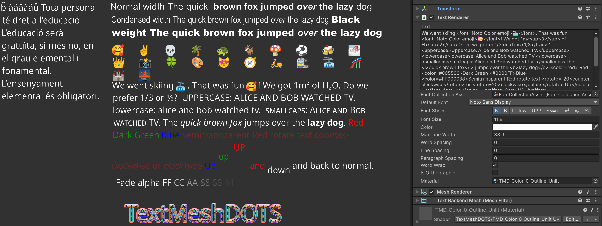
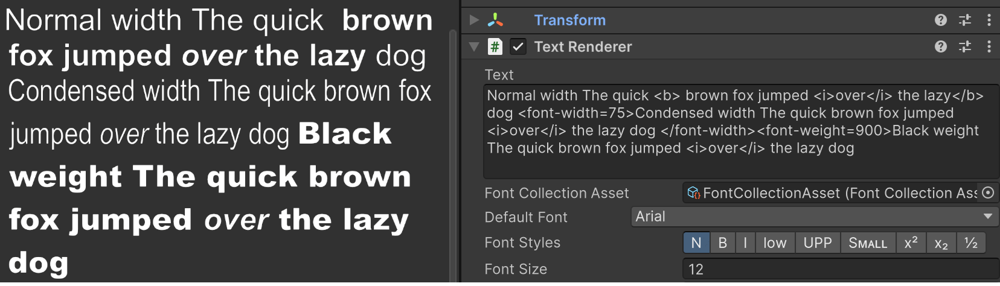
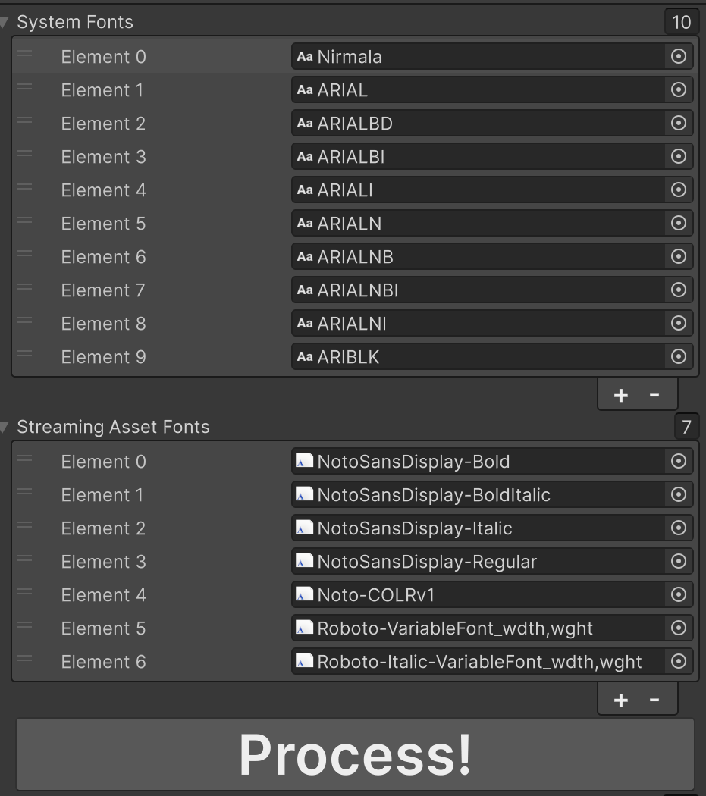
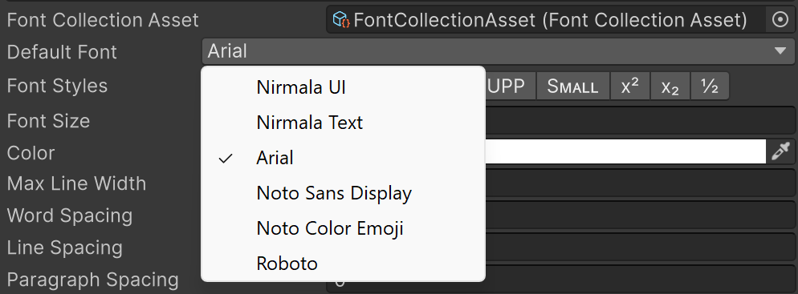
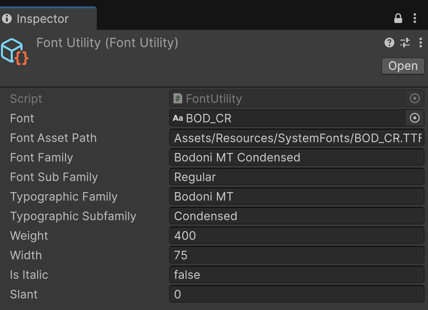

# TextMeshDOTS

TextMeshDOTS renders world space text similar to TextMeshPro. Its is a standalone text package for DOTS, 
forked from Dreaming381's [Latios Framework/Calligraphics](https://github.com/Dreaming381/Latios-Framework/tree/master/Calligraphics). 

<b>Font Support</b> Powered by [Harfbuzz](https://harfbuzz.github.io/), TextMeshDOTS is currently able to load 
TrueType fonts, TrueType Collection fonts, and OpenType fonts. Fonts can either be included as an asset, or searched 
at runtime among the system fonts available on a given target platform (Windows, Linux, MacOS etc). Selection of font 
family members ([variants](https://learn.microsoft.com/en-us/typography/opentype/spec/otvaroverview)) that differ 
in properties such as regular/italic, font weight (normal, bold, thin, etc), font width (normal, condensed, expanded etc), 
slant, optical size etc is done per `TextRenderer` via rich text tags defining the desired font family and variant properties. If 
no matching font variant for the defined properties can be found, TextMeshDOTS falls back to the font family, and 
is able to simulate bold and italic. In case a font does not contain a user provided unicode character or emoji, 
TextMeshDOTS is (for performance reasons) currently not searching for a fall back font that does contain the 
desired character - so be sure the selected font contains the characters or emoji you need.

<b>Rich Text:</b> TextMeshDOTS supports many rich text tags like [TextMeshPro](https://docs.unity3d.com/Packages/com.unity.textmeshpro@4.0/manual/RichText.html) 
and TextCore (see section below for details). User selectable [opentype features](https://learn.microsoft.com/en-us/typography/opentype/spec/featurelist) 
can be enabled using rich text tags such as \<sub\> (subscript), \<sup\> (superscript), \<frac\> (fractions), \<smcp\> (smallcaps).

<b>Color Emoji :-)</b> TextMeshDOTS is as of version 0.9.0 capable to render [COLRv1](https://developer.chrome.com/blog/colrv1-fonts) 
emoji fonts. Bitmap and svg emoji fonts are currently not supported as we did not yet find a BURST compatible 
Unity method or small public cross platform library to decode them (please reach out if you know one or can implement it).

# Technical Foundation

<b>Unity DOTS:</b> TextMeshDOTS leverages the [Unity Entities](https://docs.unity3d.com/Packages/com.unity.entities@1.2/manual/index.html) 
package, BURST, and jobs to generate all data required for rendering, and 
[Unity Entities Graphics](https://docs.unity3d.com/Packages/com.unity.entities.graphics@1.2/manual/index.html) 
for rendering.

<b>Font Resource Management</b> Prior to version 0.9.0, TextMeshDOTS used 
for each font a static atlas textures, borrowed from the Unity `TextCore` `FontAsset`. As of version 0.9.0, TextMeshDOTS 
generated all required glyph data and font textures dynamically using the [Harfbuzz](https://harfbuzz.github.io/) 
library, was however limited to one 4k atlas texture per font. Handling multiple fonts remained challening, 
which prompted Dreaming381 to vastly simplify resource management by storing all SDF and color bitmaps in ONE 
global atlas texture array. Dreaming381 also implemented a GPU resident represetation of the glyph vertex data 
and the global texture array. These GPU resident buffer are automaticaly and incrementally updated when changes occur. 

<b>Shader Support</b>
The included HDRP and URP ShaderGraph shader are based on a number of custom function nodes to provide modularity for 
decoding the GPU resident vertex data, sampling of the SDF or bitmap texture array, adding up three outlines to SDF 
glyphs, as well as colorizing/texturing SDF glyphs and outlines. Different shader variants are provided, 
with the most complex shader providing feature parity to the TextMeshPro 4.0 SRP shader. The modularity of the 
shader design enables users to expand on the provided examples and define their own custom shader. For a given 
text label (`TextRenderer`) that makes use of different fonts and emoji, TextMeshDOTS needs as of version 0.9.6
just one entity and one material.

# Autoring workflow
  -	**Generate backend mesh and materials** `Menue --> TextMeshDOTS --> Text BackendMesh`, 
    `Menue --> TextMeshDOTS --> Generate HDRP (URP) materials` This only needs to be done once in 
     a given project. The generated assets are placed into `Resources` folder. The `BackendMesh` is expected     
    at that location by the runtime, while the generated materials can be placed anywhere you like.

  - **Prepare fonts** Please note that pretty much any font such as "Arial" in Windows actually constists of 
   multiple font files (e.g. one for `regular`, one for `bold`, one for `italic`, one for `bold italic`. There 
   can be many more to provide variations of font width (regular, condensed, expanded etc), font weigth 
   (bold, sembibold, black etc), italic, different optical design sizes etc. You need all of these files 
   to enable TextMeshDOTS to automatically select the right font when you apply different `FontStyles`. 
   In TrueType Collection fonts, a number of pre-defined variants are stored within just one `ttc` file. 
   Variable fonts are simular to TrueType Collection fonts, however the files are much smaller because the 
   variants are mathematically defined via parameters influencing the shape of the bezier curves. TextMeshDOTS 
   can simulate bold and italic when those variants are missing, however this should be the exception and not the default.
      1. To use `System Fonts` (fonts that can be found on target device at runtime), drop the `ttf` `ttc` and `otf` files 
         into a folder of your choice under `Assets`. Click on the font asset and uncheck `Include Font Data` to ensure
         the file is *not* included in your build. You might wonder why to even add such fonts to your project: this 
         is only needed to extract some data to be able to correctly identify the desired fonts at runtime on the target device. 
      2. To use `Embedded Fonts`, create under `Assets` a subfolder called `StreamingAssets`. Drag and drop all 
        `ttf` `ttc` and `otf` files you intend to use there. You can organize fonts in further subfolders as you wish.  
      3. Create a `FontCollectionAsset` scriptable object: `Any folder under Assets --> Right click --> Create --> TextMeshDOTS --> FontCollectionAsset`
      4. Drag and drop the fonts prepared in the first 2 steps into the respective lists
      5. Click `Process!`
  
 
  - Create a `SubScene`  
  -	**Baking of a `FontCollection` singleton entity from the `FontCollectionAsset`**
    - Add empty `GameObject`, add `FontCollection` component to it
    - Drag and drop the `FontCollectionAsset` into the provided field
    - This singleton provides all the data needed to load the fonts and populate the global font tables used by TextMeshDOTS
  
  - **Baking of Text Labels**
    - Add empty `GameObject`, add `TextRenderer` component to it. Add optional tag components in case you like  
      to be able to use an `EntityEquery` to process a given `TextRenderer` in e.g. systems that change the label 
      (e.g. to display damage status on a character)
    - To be able to select a default font for this `TextRenderer`, drag & drop `FontCollectionAsset` into the respective field.
      Once you have done this, you should be able to select a font family in the `Default Font` dropdown:
     
    - Drop a material of your choice (generated in the first step) into the respective field
    - Type in some text or rich text
    - You should now see the text
    - Fontsyles are changed either using the buttons on the `TextRenderer`, or via rich text tags such as \<b\> (bold), 
      \<i> (italic). The \<font\> rich text tag can be used to explicitly select a different font family.
      
  - **Optional use of Gradients**:
    - Add empty `GameObject`, and `TextColorGradient` component on it
    - Add any number  gradients to the list. You need to name the gradients to be able to select them 
      via the richtext tag \<gradient=name of gradient\> For horizontal gradients, specify at least the top left & right color. 
      For vertical gradients at least top & bottom-left. Otherwise specify all corner.

# Runtime workflows
(1) Optional Runtime font instantiation workflow
  -	In case you like to load fonts while your app is running, you can use the approach found 
    in the package folder `TextMeshDOTS\RuntimeSpawner\RuntimeFontSpawner.cs`
  - You will notice, that you need to manually fill out a lot of information in the `FontRequest` struct for every font 
    you intend to use. This information can be extracted utilizing the `FontUtility` Scriptable Object.
    
    - Right click in a folder, then `Create --> TextMeshDOTS --> Font Utility`
    - Drag and drop the fonts from `StreamingAssets` or from anywhere else in your project 
      (in case you intend to use `System Fonts`) into the font field, and copy the information 
      over into your runtime spawner. I know this is cumbersome, and in order to improve the workflow I would love 
      to hear about your concrete use cases that would require dynamic loading of fonts at runtime.

(2) Optional spawning of `TextRenderer` at runtime
  - In case you like to generate text labels at runtime, you can use the approach found 
    in the package folder `TextMeshDOTS\RuntimeSpawner\RuntimeTextRendererSpawner.cs` 
    and `TextMeshDOTS\RuntimeSpawner\RuntimeMaterialSpawner.cs` Per default, auto creation of both systems 
    included in the package is disabled. In case you like to test this workflows, enable both systems, hit play and 
    you should see some text spawned at runtime.
  

# Changing text at runtime
  - Text is stored in the `CalliString` DynamicBuffer. Querry for that buffer and change it. Identify `TextRenderer`
    of your choice via `EntityQuery` by adding optional tag components.

# Supported Richtext Tags

\<align=...\> \<allcaps\>, \<alpha=xx\>, \<b\>, \<color=...\>, \<cspace=xx\>, \<gradient=...\>
\<font=...\>, \<font-weight=xxx\>, \<font-width=xxx.x\>, 
\<fraction\>, \<i>, \<indent=xx> \<lowercase\>, \<sub\>, 
\<sup\>, \<size=xx\>, \<space=000.00\>, \<mspace=xx.x\>, \<smallcaps\>, 
<scale=xx.x>, \<rotate=00\>, \<voffset=00\>.  Permitted size units are 'pt','px', 'em' and '%' or nothing 
(e.g. font-weight, font-width). Permitted values for named colors (\<color=red\>) are red, lightblue, blue,
grey, black, green, white, orange, purple, yellow. String values (such as named colors or font names) are recognized 
with and without surrounding quotation marks. Hexadecimal colors are either specified using the 
color keyword \<color=#005500\>, or directly without the color keyword as  \<#005500\>. 
Alpha values are specified via \<alpha=#FF\>.

# Known issues
  - \<aling\> works only for left, center and right (not justified and flush)
  - \<sub\> and \<sup\>  are currently implemented using the font opentype feature. For most 
    fonts, this only works  for digits and a few characters. One could simulate this via scaling & offsetting, 
   but this comes at the cost of glyphs that are optically too thin

## Special Thanks to the original authors and contributors

-   Dreaming381 - not only has he created the amazing [Latios Framework](https://github.com/Dreaming381/Latios-Framework), 
   including the Calligraphics text module, but has also been of tremendous support in figuring out how to create 
   a standalone version of Calligraphics that uses Entity Graphics instead of the Kinemation rendering engine. 
   Furthermore, Dreaming381 made the harfbuzz library accessible as plugin across platforms via the
   [HarfbuzzUnity](https://github.com/Dreaming381/HarfbuzzUnity) plugin for MacOS, Linux and Windows, and 
   implemented the core systems for managing the texture arrays and glyph rendering.
-  Sovogal – significant contributions to the Calligraphics module of Latios Framework (including the name)
